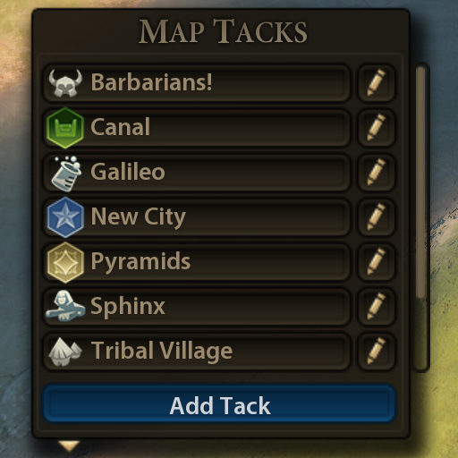

# Map Tacks 0.9.2 
Enhances map pin list  
Adds new icon options  
Fixes base-game bugs  
Improves layout and styling  
Compatible with popular UI mods

## Scrollable map pin list
The list dynamically resizes to show up to 15 map pins, with a scrollbar to
manage longer lists. It groups all named pins at the top, followed by all
unnamed pins in numerical order.

## New icons
The map pin editor adds new icons for districts and improvements, including
unique districts, unique improvements, and suzerain bonuses. It also adds icons
for all builder and engineer actions, great people, and several common unit
operations, plus a golden hexagon to mark wonder sites.

## Bug fixes and restyling
The mod fixes a few base-game bugs and styling problems: The pin list cannot
grow past the top of the screen. Unnamed pins sort correctly when there are
more than ten. Labels and controls have more consistent alignment and spacing.

## Compatibility
The Map Tacks mod does not affect saved games. You can add it to a game in
progress or disable it without breaking your game. Enabling or disabling the
mod will not remove any pins that are already on your map, but some may change
color. This mod layers on top of CQUI, replacing its map pin features.
